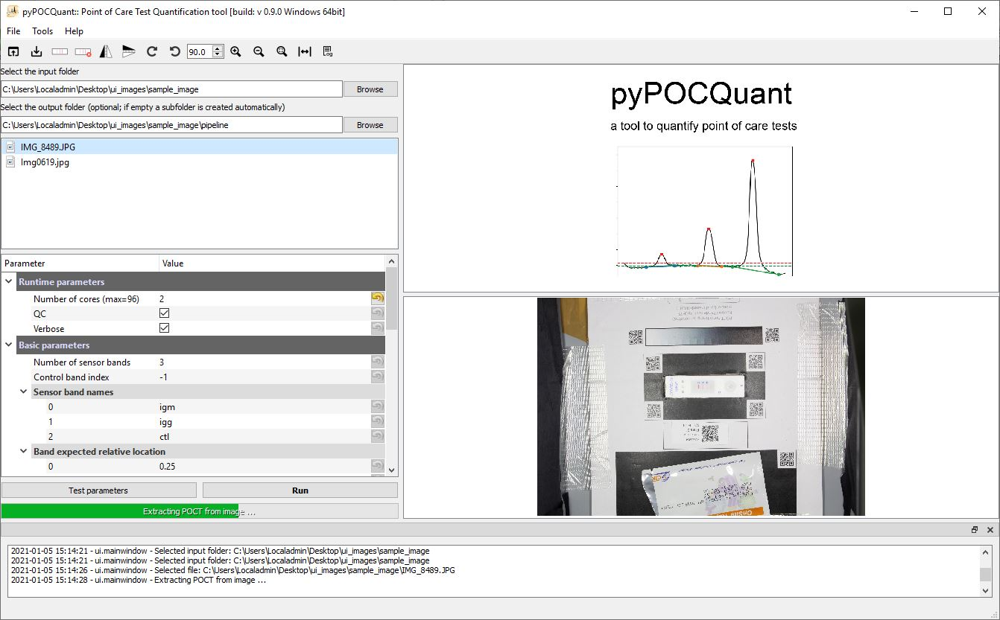
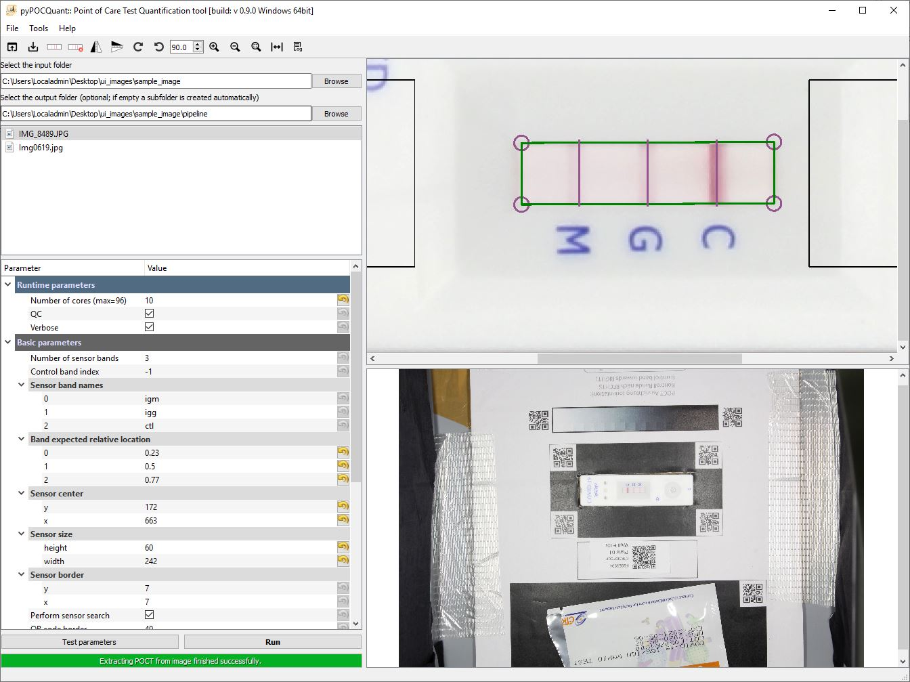
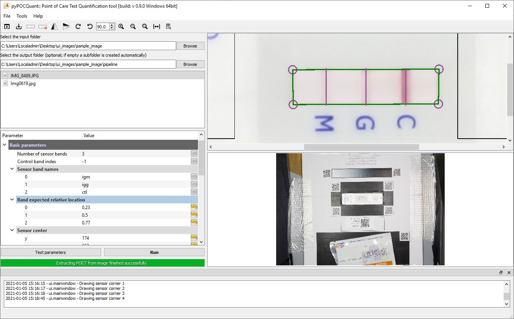
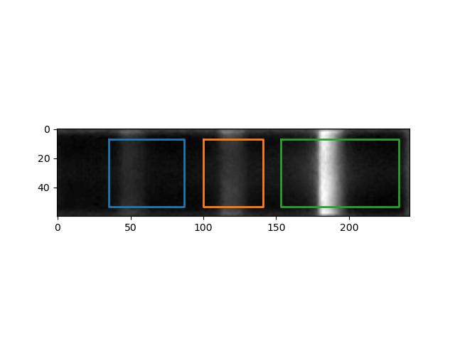

# pyPOCQuant quick start

For a reproducible and comparable analysis of your POCTs with __pyPOCQuant__, please carefully follow these instructions. They will show how to properly prepare the acquisition setup, the acquisition itself and the analysis of the images from lateral flow assays (LFA) / point of care tests (POCT).

This _quick start_ guide focuses on the most relevant points. For detailed information read the relevant section in the _user manual_ (Help -> Manual) .

## Preparation of the imaging acquisition setup

#### Materials needed:

* Camera, for example SLR/mirror less (recommended, use raw and jpg), pocket camera, mobile phone

* POCT Template / mount.

* A tripod to mount the camera above the POCT template and mount. Alternatively, a box (plastic box, or even a shoe box) can be used to mount the camera at a defined distance above the POCT template.

* Tape, glue, scissors or scalpel to fix and build the mounts.

* Printer to print the POCT template and the sample QR labels.

* Power bar to charge the camera batteries or power it directly.

* Desktop computer or laptop to transfer the images and run __pyPOCQuant__.

#### Instruction to build the POCT mount with the POCT template

Print our generic template (get it from Help -> POCT template) in black and white (ideally on non glossy paper to avoid disturbing reflections) and place the POCT to evaluate in the center of the QR code box. Cut out its cartridge outline with a scalpel or scissors (Fig. 1). The fine red grid will help you to align the POCT nicely with the QR code box border. _Note: needs to be repeated for each cartridge design if its size changes._

Glue or stick the template on one or two cartons and again cut out the region to place the POCT (Fig. 2). _Note: the narrower you cut the better it will hold the POCT at the exact same position._

The basis of the template mount could also be 3D printed or laser cut from any material and aligned with the POCT template to build a solid POCT mount.

| Fig. 1                               | Fig. 2                                    |
| ------------------------------------ | ----------------------------------------- |
|  |  |

#### Instructions to build the photo box / acquisition station

While setting up the imaging acquisition station there are three important points to consider. 

 * First, make sure that you have __constant lightning conditions__. If just using the POCT template and a tripod (Fig. 3) make sure you have a dark room otherwise daylight changes will influence the images. Best would be using a photo box (Fig.4). _Note: Our POCT template changed over the course of the development but we don't have images of the setup from each stage. Here you see a very early incomplete version of it. Please us the one presented in Fig. 1_.

 * Second, make sure that during a series of tests of the same kind __the camera is well fixed on the tripod__. Ideally you use the camera timer option or a remote control to release the images to make sure that the distance between the camera and the POCT on the POCT template is constant.

 * Third, make sure that __the field of view does not change during a series__. For this the POCT template is well fixed on the table and the tripod with camera is not moved. If this is not the case, you will need to create a configuration file for each image, and will not be able to easily batch process them!

| Fig. 3            | Fig. 4                                      |
| ----------------- | ------------------------------------------- |
|  |  |

## Image acquisition

Do __not write to or stick anything on the POCT__. Use the QR code labels instead to allow for machine readable identification of the sample and place the QR above the QR code box in its dedicated place.

Step 1: 

* Check that __all QR codes on the template__ are in the field of view and on the image.

Step 2:

* Check that the light conditions are constant and there are __no shadows on the POCT / sensor area__ and there are __no reflections__.

Step 3:

* Check that there are no vibrations during the acquisition which could lead to a bad or blurred image. If possible, use __a remote control or computer control to take the images__. If not available, use the timer option carefully to avoid moving the camera.

Step 4:

* Check that the image __is sharp and in focus: in particular the POCT sensor area and the QR codes__.

| Example image meeting all criteria's sufficiently except that the packaging is cut off. _Note: pyPOCQuant will detect the orientation of the image automatically. There is no need to rotate the images_ |
| ------------------------------------------------------------ |
|                          |

## Analysis of the images with pyPOCQuant

* Follow the installer guide lines to install __pyPOCQuant__
* Install tesseract for your operating system by following these steps: https://tesseract-ocr.github.io/tessdoc/Home.html. Note: in Linux you need also `libzbar`. In Ubuntu, you can install both with `sudo apt install libzbar0 tesseract-ocr`.

Note: For most images it is sufficient to just load an image (Step 3 & 4) and draw the sensor (Step 5) and then test the automatically determined & default parameters with (Step 7) and finally run it on all images (Step 8).

Step 1: 

* Copy the images of the same kind (i.e., same POCT cartridge / manufacturer and/or same imaging station, objective, distance to the sample) into a folder. _Note that the UI allows you to automatically split the images by manufacturer into subfolders (if  included in the QR code labels); in addition, we provide a script to do so from the command line. For the details read the respective sections in the user manual (`Help -> User manual`)._

Step 2:

* Start __pyPOCQuant__.

Step 3:

* Select the image folder you want to analyze. Click on `Browse` input folder (`Ctrl+I`).
* (Optional) Click on `Browse` result folder to select the folder where to save results, logs and quality control images. By default, a subfolder `pipeline` is created in the input folder.

Step 4:

* Click on one image (ideally one which shows all bands) to load it. After a while (green progress bar fully to the right) the POCT area will be extracted and displayed on the top-right canvas.

| Image selected - strip extraction pending | Image selected - strip extraction done and displayed |
| ----------------------------------------- | -------------------------------------------------- |
|  |  |

Step 5:

* Hit the draw sensor icon in the toolbar and click into the image to draw a rectangle around the sensor area.

  The parameters `sensor_center`, `sensor_size` and `sensor_search_area` will be set automatically in this step.

| Click into the corners of the sensor to draw the sensor outline | Drawing finished. Parameters `sensor_center`, `sensor_size` and `sensor_search_area` have now been set automatically |
| ------------------------------------------------------------ | ------------------------------------------------------------ |
|  |   |

Step 6:

* Adjust the expected position of the bands by clicking on the vertical violet lines and move them in place such that they are centered and overlapping with the bands on the test. Optionally, you can also fine-adjust by changing the parameters in the tree.

| Not properly aligned control band line (vertical violet line). `peak_expected_relative_location`=(0.23, 0.5, 0.7) | Properly aligned band lines `peak_expected_relative_location`=(0.23, 0.5, 0.77) |
| ------------------------------------------------------------ | ------------------------------------------------------------ |
|                      | !                   |

Step 7 

* Change the band labels for t2, t1 and ctl band according to the test analyzed. For example `sensor_band_names=(IgG, IgM, Ctl)`. These names will be used as prefixes in the header of the result table.

Step 8:

* Hit `Test parameters` and check the result based on the quality control images. If you get false positive detections for weak signals increase the advanced parameter `sensor_thresh_factor` and hit test again.

* If the result looks good (check the quality control images `IMAGE_NAME_peak_overlays control image`, and `IMAGE_NAME_peak_analysis control image` and the entries in the `quantification data.csv` file), you can continue. Otherwise adjust the parameters further, look up the advanced parameters in the manual, or check the common problems and solutions below.

| IMAGE_NAME_peak_overlays control image                 | IMAGE_NAME_peak_analysis control image                 |
| ------------------------------------------------------ | ------------------------------------------------------ |
|  |  |

  

Step 9:

* Hit `Run` to batch analyze all images in the folder in parallel.

  

Repeat the procedure for all other folders. _Note: if the POCT cartridge design changes or a different camera with a different perspective is used, a new configuration file has to be generated and tested. Otherwise, one can load the same configuration file also for other / new images. To load a configuration file just double-click on it if it is in the same folder as the input images, or hit `Ctrl+O` or select `File -> Load settings from file`_

## Potential problems and their solution:

__Problem__: There are artifacts / weak signals that get quantified wrongly as a band (Fig. 5)

__Solution__: Increase the `sensor threshold factor` (Fig. 6)

| Fig 5 `sensor threshold factor=1`                            | Fig 6 `sensor threshold factor=2`                            |
| ------------------------------------------------------------ | ------------------------------------------------------------ |
|  |  |
|  |  |

__Problem__: _One or more bands were missed_ or _the wrong band(s) were extracted_ (Fig. 7)

__Solution__: Adjust the `Peak expected relative location` parameter for the band(s) which were not detected. If that did not solve the problem check the quality-control images if the sensor was detected correctly. If not adjust the sensor position and its size (Fig. 8).

| Fig 7                                                        | Fig 8                                                        |
| ------------------------------------------------------------ | ------------------------------------------------------------ |
|  |   |
|  |   |

__Problem__: Almost no pixels are considered for quantification (Fig. 9)

__Solution__: Reduce the `sensor border x|y` values to consider more pixels of the sensor (Fig. 10). If it considers too many pixels increase the parameter values.

| Fig 9 `sensor border x|y=25`                                 | Fig 10  `sensor border x|y=7`                                |
| ------------------------------------------------------------ | ------------------------------------------------------------ |
|  |  |

__Problem__: I have a lot of images to be processed and it is slow.

__Solution__: Increase the `Number of cores` parameter to the maximum of your computer. Use a more powerful station or cluster.

__Problem__: By accident, the image was taken with the POCT wrongly oriented and the control band is left (Fig. 11).

__Solution__: Select the checkbox `try to correct strip orientation`. This will try to rotate the image correctly for the analysis (Fig 12). The qc image lets you verify if the correction works. If it does not work modify the parameters  (_Relative height factor_, _Relative center cut-off_, _Relative border cut-of_) defining the size and position of the search rectangles. The red rectangle (Fig. 11) indicates where the inlet was found and will rotate the image such that the inlet is left and the control band on the right (Fig. 12). The search rectangles should only include the region around the pipetting inlet. If it still does not work, the last chance is to try and search for some text printed on one side of the POCT. Add the prominent text (for example, "COVID" as in Figg. 11 or 12) to the `Strip text to search (orientation)` parameter and select if the text   is on the right or not (check or uncheck the `Strip text is on the right` parameter). If this still fails, the image will have to be discarded and a new one will need to be reacquired.

| Fig 11                                                       | Fig 12                                                       |
| ------------------------------------------------------------ | ------------------------------------------------------------ |
|   |   |

__Problem__: I have a lot of images from with different POCT cartridge designs from different manufacturers taken with the same camera but my configuration file does only work for one type.

__Solution__: Split the images into a subfolder for each cartridge design / manufacturer. If you used the QR code sample labels you can use the script described in the manual to do this automatically for you. 

__Problem__:  I have a lot of images with different POCT cartridge designs from different manufacturers. Do I really need a separate configuration for each design?

__Solution__: Unfortunately yes. As they come in any shape the software needs some specific guidance to know where to search for the bands and to allow for robust and reproducible results. One solution to relax this assumption would be to change the POCT cartridge design by including small qr codes directly next to the sensor. That would allow us also to get rid of the QR code template. If you have a direct contact to your favorite manufacturer, tell them about it and their potential competitive advantage in the market (Fig 13)! 

| Fig 13                                        |
| --------------------------------------------- |
|  |

