# pyPOCQuant user manual

## Introduction <a name="introduction"></a>

The tool __pyPOCQuant__ aims to automatically detect and quantify signal bands from __lateral flow assays__ (__LFA__) or **Point of Care tests** (**POC** or **POCT**) from an image. It can batch analyze large amounts of images in parallel.

An analysis pipeline can be run either from the command line (good for automating large numbers of analysis) or from a desktop application.

> At current stage, almost all operations are supported from the user interface, with the exception of the optional [Split images by strip manufacturer](#Split-images-by-POCT-manufacturer) step.

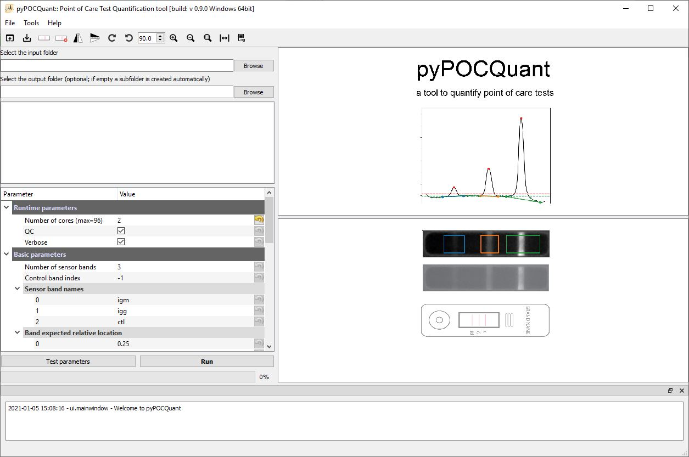

## Command line workflow <a name="command_line_workflow"></a>

1. Split images by POCT manufacturer if needed
2. Copy all the images of the same kind into one folder
3. Prepare a settings file
4. Run the pipeline

### Split images by POCT manufacturer

> This only applies if you collected many images using POCTs from different vendors and stored all the images in one common folder! Analysis settings would need to be slightly adapted for different POCTs shapes and sizes.

If you have many images in an unorganized way we provide a helper script to sort them by manufacturer into subfolders.

> This is currently not integrated into the user interface and needs to be run from console.

```bash
$ python ./split_images_by_strip_type_parallel.py -f /PATH/TO/INPUT/FOLDER -o /PATH/TO/OUTPUT/FOLDER -w ${NUM_WORKERS}
```

* `/PATH/TO/INPUT/FOLDER`: path to the folder that contains all images for a given camera.

* `PATH/TO/OUTPUT/FOLDER`: path where all images will be organized into subfolders; one per each strip manufactured. Strip images that cannot be recognized (or do not contain any strip) will be moved to an ` UNDEFINED` subfolder.

  * Currently  recognized manufacturers: 
    * `AUGURIX`
    * `BIOZAK`
    * `CTKBIOTECH`
    * `DRALBERMEXACARE`
    * `LUMIRATEK`
    * `NTBIO`
    * `SUREBIOTECH`
    * `TAMIRNA`

**Please notice**: the list of known manufacturers is defined in `pyPOCQuant.consts.KnownManufacturers`.

* `NUM_WORKERS`: number of  parallel processes; e.g. `8`.

### Settings file preparation <a name="settingsprep"></a>

You can prepare a default parameter file from the command line as follows:

```bash
$ python ./pypocquant/pyPOCQuant_FH.py -c /PATH/TO/INPUT/settings_file.conf
```

Open the file in a text editor and edit it.

```bash
max_workers=2
qc=True
verbose=True
sensor_band_names=('igm', 'igg', 'ctl')
peak_expected_relative_location=(0.25, 0.53, 0.79)
sensor_center=(178, 667)
sensor_size=(61, 249)
sensor_border=(7, 7)
perform_sensor_search=True
qr_code_border=40
subtract_background=True
sensor_search_area=(71, 259)
sensor_thresh_factor=2.0
raw_auto_stretch=False
raw_auto_wb=False
strip_try_correct_orientation=True
strip_try_correct_orientation_rects=(0.52, 0.15, 0.09)
strip_text_to_search='COVID'
strip_text_on_right=True
force_fid_search=True
```

> Some of the parameter names contain the term `strip`: this is used to indicate the POCT. The prefix `sensor` indicates the measurement region within the `strip`.

See [Explanations](#Explanations) for detailed description of the parameters.

> Please notice that some parameters are considered "Advanced"; in the user interface the parameters are separated into "Runtime parameters", "Basic parameters", and "Advanced parameters".

#### How to determine the parameters manually <a name="settingsprepm"></a>

Open the [settings file](#Settings) and adjust the parameters to fit your images.

Important parameters are the `sensor_size`, `sensor_center`, and `sensor_search_area` (the latter being an advanced parameter).

> The user interface allows to easily define those parameters by drawing onto the extracted POCT image.

Sensor parameters are relative to the POCT image.

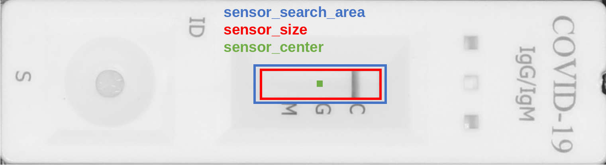

In the following we show how to obtain position and extent of the sensor areas in Fiji or ImageJ. Later we will see how to do the same in the pyPOCQuant user interface.


* When drawing a rectangular region of interest, the size is displayed in Fiji's toolbar; e.g. `x=539, y=145, **w=230, h=62**`.
* When hovering over the central pixels in the top or left sides of the selection, the `x`, and `y` coordinates of the center, respectively, are show in Fiji's toolbar; e.g. `x=*601*, y=144, value=214` (and equivalently for `y`).

### Run the pipeline <a name="runpipline"></a>

#### Run the analysis per manufacturer manually <a name="runpiplinem"></a>

```bash
$ python pyPOCQuant_FH.py -f /PATH/TO/INPUT/FOLDER/MANUFACTURER -o /PATH/TO/RESULTS/FOLDER -s /PATH/TO/CONFIG/FILE -w ${NUM_WORKERS} 
```

* `/PATH/TO/INPUT/FOLDER/MANUFACTURER`: path to the folder that contains all images for a given camera and manufacturer.
* `/PATH/TO/RESULTS/FOLDER`: path where the results (and the quality control images) for a given camera and manufacturer will be saved. The results are saved in a `quantification_data.csv` text file.
* `/PATH/TO/CONFIG/FILE`: path to the configuration file to be used for this analysis. Please see below. Notice that a configuration file will be needed per manufacturer and (possibly) camera combination.
* `NUM_WORKERS`: number of  parallel processes; e.g. `8`.

## GUI workflow <a name="gui_workflow"></a>

1. Split images by POCT manufacturer if needed
2. Copy all the images of the same kind into one folder
3. Select the folder containing the images to be processed
4. Set all analysis parameters
5. Run the pipeline

### Split images by POCT manufacturer <a name="splitimages_gui"></a>

> This only applies if you collected many images using POCTs from different vendors and stored all the images in one common folder! Analysis settings would need to be slightly adapted for different POCTs shapes and sizes.

Please notice that this step has not been integrated into the user interface yet, and must be [run from the command line](#Split-images-by-POCT-manufacturer).

#### How to determine the parameters automatically using the GUI <a name="settingsprepa"></a>

A settings file must not necessarily be created in advance. The Parameter Tree can be edited directly. Optionally, settings can be loaded or saved from the UI. 

How to estimate sensor parameters graphically in the UI:

* `Select the input folder` and click on one of the listed images to display it. The POCT region will be automatically extracted and shown in the view at the top. The lower view shows the whole image.

* Hit the `Draw sensor outline` icon (red arrow) in the toolbar. This will allow you to interactively define the `sensor area` and the `peak_expected_relative_location` parameters.

| Drawing sensor by clicking into the corners | Drawing finished with aligned bars      |
| ------------------------------------------- | ----------------------------------------- |
|  | 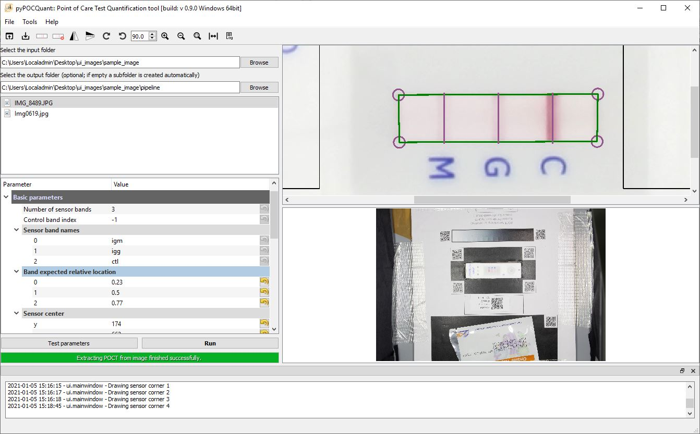 |

  

* Draw the four corners of the sensor and place the vertical bars on the bands. This will cause all relevant parameters to be populated in the Parameter Tree. Please notice that, by default, the `sensor_search_area` is set to be 10 pixels wider and taller than the `sensor_size`. This can be changed in the advanced parameters (but beware to keep it only slightly larger than the `sensor_size`: it is meant only for small refinements).

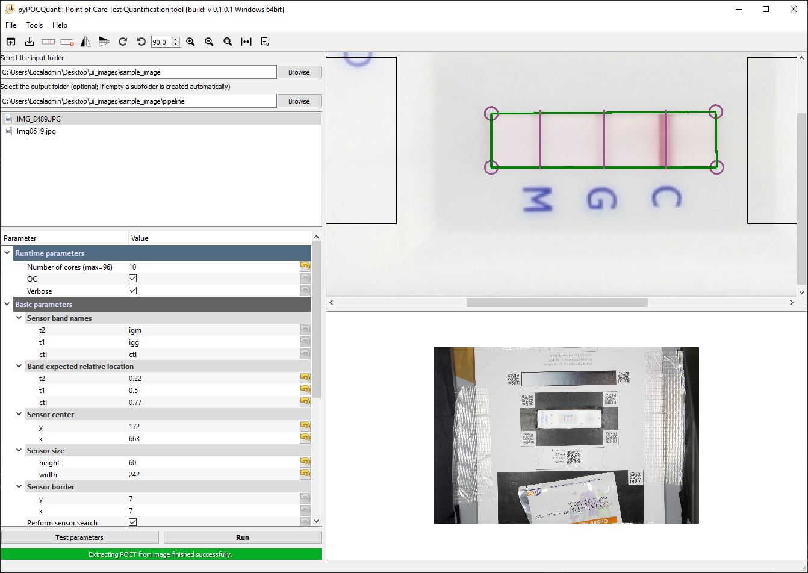

* You can test current parameters on one image by clicking the `Test parameters` button under the Parameter Tree.
* Optionally, you can save the settings file (Ctrl+S, `File`->`Save settings file`)

#### Run the analysis per manufacturer automatically using the GUI  <a name="runpiplinea"></a>

Once the previous steps are done and all parameters are correctly set, you can hit the `Run` button to start the analysis.

_Note: a step by step guide can be found under **Quick start** (`Help -> Quick start`)_

## Settings

The following settings must be specified. These are default values and need to be adopted for a series of the same kind of images. Please note: in the following, `strip` is used to indicate the POCT, and `sensor` to indicate the measurement region within the `strip`.

```bash
max_workers=2
qc=True
verbose=True
sensor_band_names=('igm', 'igg', 'ctl')
peak_expected_relative_location=(0.25, 0.53, 0.79)
sensor_center=(178, 667)
sensor_size=(61, 249)
sensor_border=(7, 7)
perform_sensor_search=True
qr_code_border=40
subtract_background=True
sensor_search_area=(71, 259)
sensor_thresh_factor=2.0
raw_auto_stretch=False
raw_auto_wb=False
strip_try_correct_orientation=True
strip_try_correct_orientation_rects=(0.52, 0.15, 0.09)
strip_text_to_search='COVID'
strip_text_on_right=True
force_fid_search=True
```

### Explanations

#### Runtime parameters

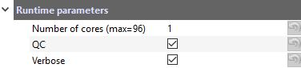

##### max_workers

* The analysis can work in parallel. Specify the maximum number of images that are run in parallel. The maximum allowed value is the number of cores in your machine.

##### qc

* Toggle creation of quality control images.
* Possible values: `True` or `False`
* Recommended: `True` when testing parameters.

##### verbose

* Toggle extensive information logging.
* Possible values: `True` or `False`
* Recommended: `True` when testing parameters.

#### Basic parameters

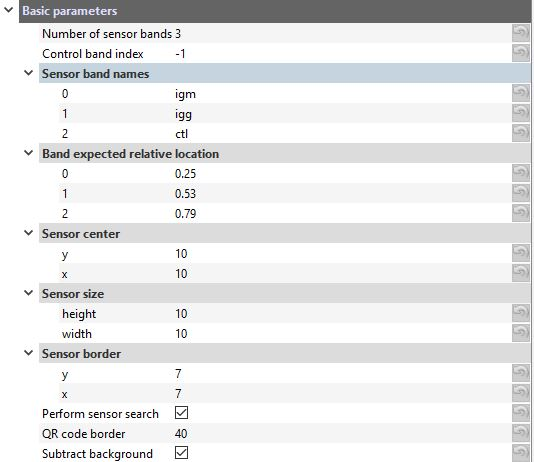

#### sensor_band_names

* Custom name for the three bands `t2`, `t1` and `ctl` (e.g., `IgM`, `IgG` and `Ctl`).

##### peak_expected_relative_location

* Expected relative peak positions as a function of the width of the sensor (= 1.0). These values can easily be set interactively [using the UI](#settingsprepa).

##### sensor_center

*  Coordinates in pixels of the center of the sensor with respect to the strip image: `(y, x)`.

##### sensor_size

* Area in pixels of the sensor to be extracted: `(height, width)`.

##### sensor_border

* Lateral and vertical sensor border in pixels to be ignored in the analysis to avoid border effects: `(lateral, vertical)`.

##### perform_sensor_search

* If `True`, the (inverted) sensor is searched within `sensor_search_area` around the expected `sensor_center`; if `False`, the sensor of size `sensor_size` is simply extracted from the strip image centered at the relative strip position `sensor_center`.
* Possible values: `True` or `False`
* Recommended: `True`

##### qr_code_border

* Lateral and vertical extension of the (white) border around each QR code.

##### subtract_background

* If `True`, estimate and subtract the background of the sensor intensity profile (bands).
* Possible values: `True` or `False`
* Recommended: `True`

#### Advanced parameters

These parameters will most likely work with the default values above.

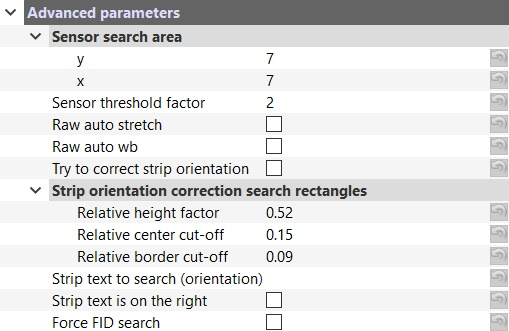

##### sensor_search_area

* Search area in pixels around the sensor: `(height, width)`. 
* Used only if `skip_sensor_search` is `False`.
* **Try to keep it just a bit larger than the sensor size: in particular, try to avoid picking up features (e.g. text) in close proximity of the sensor.**

##### sensor_thresh_factor

* Set the number of (robust) standard deviations away from the median band background for a peak (band) to be considered valid.
* Recommended: `2`, maybe `3`.

##### raw_auto_stretch

* Whether to automatically correct the white balance of RAW images on load. This does not affect JPEG images!
* Possible values: `True` or `False`
* Recommended: `False`

##### raw_auto_wb

* Whether to automatically stretch image intensities of RAW images on load. This does not affect JPEG images!
* Possible values: `True` or `False`
* Recommended: `False`

##### strip_try_correct_orientation

* Whether to automatically try to rotate a POCT that was mistakenly placed on the template facing the wrong direction (and where the control band is on the left instead of on the right). The pipetting inlet will be searched in the POCT; the inlet is assumed to be found on the side opposite to the control band, and always on the left. If found on the right, the image will be rotated.
* Possible values: `True` or `False`
* Recommended: `True`

##### strip_try_correct_orientation_rects

* Parameters for defining two rectangles left and right from the sensor center to be used to detect the pipetting inlet. The first parameter, `Relative height factor`, defines the relative height of the rectangles with respect to the strip. The second parameter, `Relative center cut-off`, defines the relative offset from the sensor center and therefore the width of the rectangle. Finally, the third parameter, `Relative border cut-off`, defines the relative offset from the strip's left and right borders and hence the width of the search rectangle.
* Possible values: `(0:1, 0:1, 0:1)`
* Recommended: `(0.52, 0.15, 0.09)`

##### strip_text_to_search

* Whether to use a specific text printed on the POCT to automatically try to rotate a POCT that was mistakenly placed on the template facing the wrong direction (and where the control band is on the left instead of on the right). Set to `""` to skip search and correction. If the strip has some text printed on either side of the sensor, it can be searched to guess the orientation. See also `strip_text_on_right`.

##### strip_text_on_right

* Assuming the strip is oriented horizontally, whether the `strip_text_to_search` text is expected to be on the right. If `strip_text_on_right` is `True` and the text is found on the left hand-side of the strip, the strip will be rotated 180 degrees.
* Ignored if `strip_text_to_search` is `""`.

##### force_fid_search

* If force fid search is activated, try hard (and slow!) to find an FID on a barcode or QR code label on the image identifying the sample.
* force_fid_search=True

## Results <a name="resultsdescription"></a>

The analysis pipeline delivers a `.csv` that contains a relatively large table of results. The extracted features are explained in the following.

### Result table <a name="resulttable"></a>

Structure and description of the result table:

`fid`: patient FID in the form `F5921788`

`fid_num`: just the numeric part of the FID (i.e., `5921788`)

`filename`: name of the analyzed image

`extension`: extension (either *.JPG or *.ARW, *.CR2, *.NEF)

`basename`: filename without extension

`iso_date`: date of image acquisition in the form YYYY-MM-DD (e.g. 2020-04-14)

`iso_time`: time of image acquisition in the form HH-MM-SS (24-h format)

`exp_time`: camera exposure time

`f_number`: aperture F number

`focal_length_35_mm`: 35mm equivalent focal length

`iso_speed`: camera ISO value

`manufacturer`:  POCT manufacturer

`plate`: plate number

`well`: well (e.g. `A 01`)

`ctl`: 1 if the control band could be extracted, 0 otherwise.

`t2`: 1 if the `t2` band (e.g. IgM) could be extracted, 0 otherwise.

`t1`: 1 if the `t1` band (e.g. IgG) could be extracted, 0 otherwise. 

`ctl_abs`: absolute signal strength of the control band,

`t2_abs`: absolute signal strength of the `t2` band,

`t1_abs`: absolute signal strength of the `t1` band.

`ctl_ratio`: relative signal strength of the control band (always 1.0 if detected)

`t2_ratio`: relative signal strength of the `t2` band with respect to the control band

`t1_ratio`: relative signal strength of the `t1` band with respect to the control band

`issue`: if issue is 0, the image could be analyzed successfully, if issue > 0 it could not. See the list of issues below

`user`: custom field

> Note: expect small residual variations in the absolute signal strengths (`ctl_abs`, `t2_abs`, and `t1_abs`) across images in a batch due to inhomogeneities  in acquisition.

#### Analysis issues<a name="analysisissues"></a>

Each analyzed image is assigned an integer `issue`:

* 0: no issue, the analysis could be performed successfully

* 1: barcode extraction failed

* 2: FID extraction failed

* 3: poor strip alignment

* 4: sensor extraction failed

* 5: peak/band quantification failed

* 6: control band missing

### Quality control images <a name="resultimages"></a>

Types and examples' of quality control images:

Raw image shown as comparison:

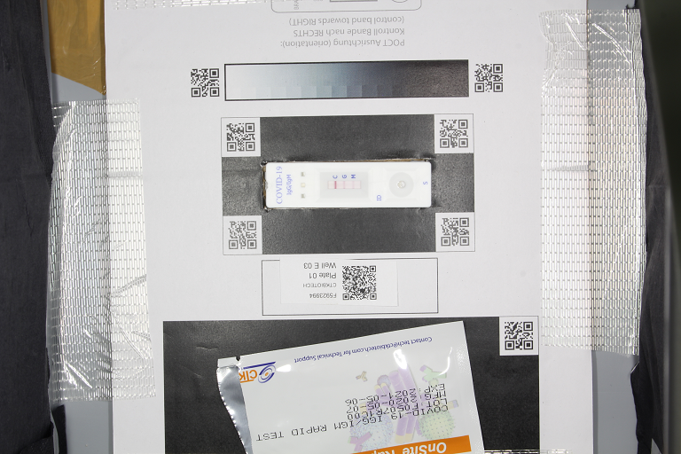

* `IMAGE_FILE_NAME_aligned_box` Aligned raw image

  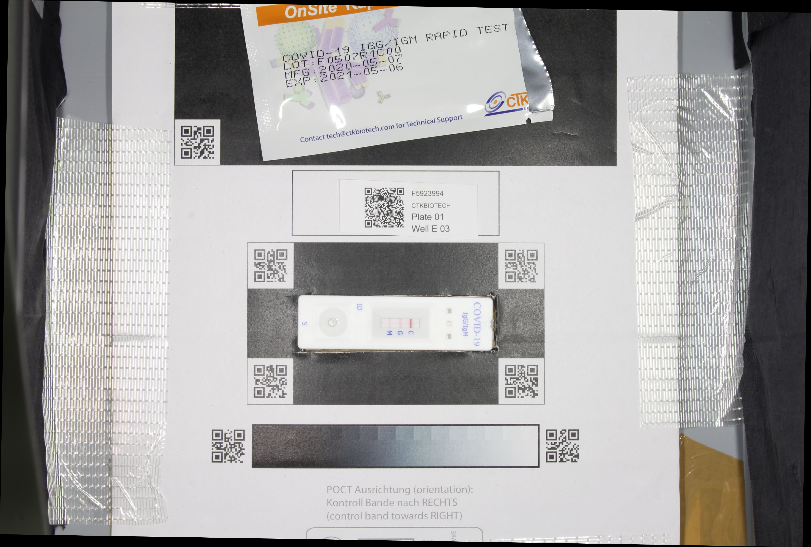

* `IMAGE_FILE_NAME_box` : QR code box around the POCT oriented such that the control band is always on the right side.

  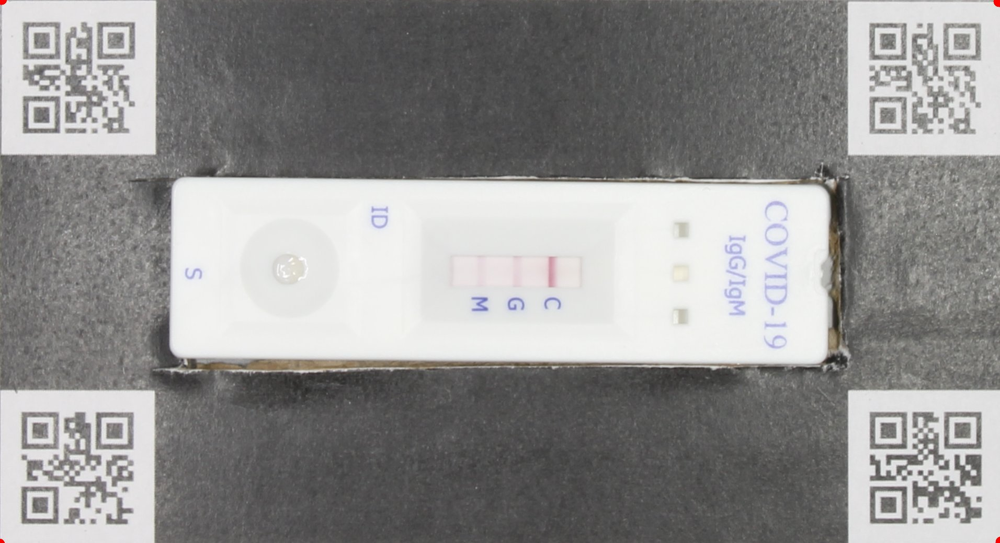

* `IMAGE_FILE_NAME_rotated`: Raw image rotated such that the POCT is at the parallel to the bottom side of the image.

  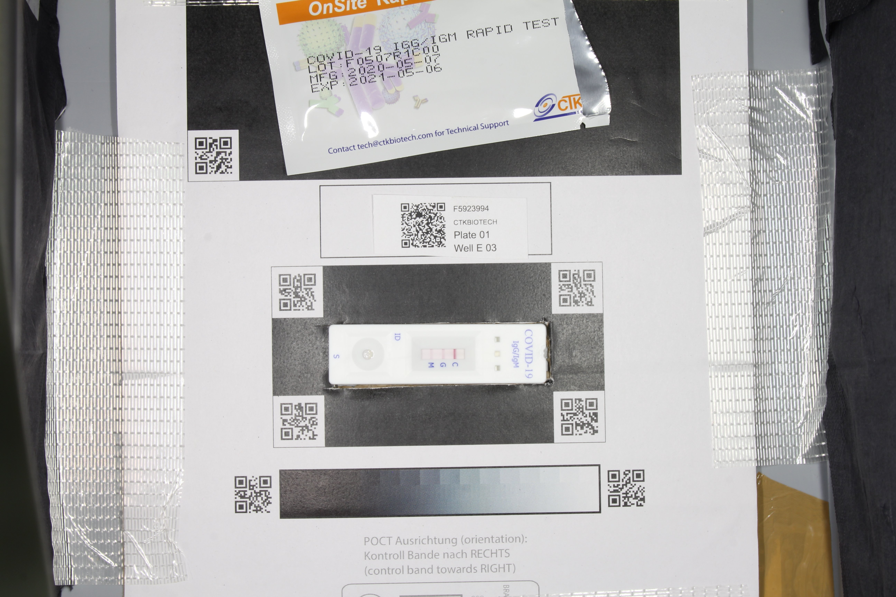


* `IMAGE_FILE_NAME_strip_gray_aligned`: Aligned POCT cropped around its outline such that it is parallel to the bottom side.

  


* `IMAGE_FILE_NAME_strip_gray_aligned_after_ocr` Aligned POCT cropped around its outline such that it is parallel to the bottom side after OCR filtering such that the pipetting part is always left (for the cases where the POCT was not placed in the correct orientation in the template.)

  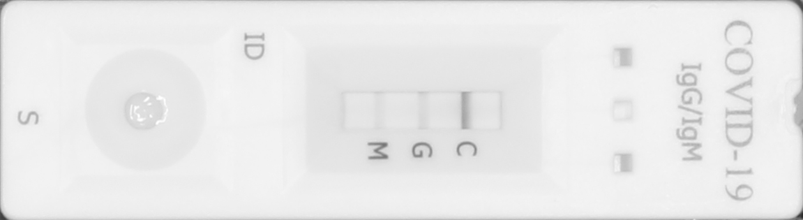


* `IMAGE_FILE_NAME_strip_gray_hough_analysis.png` Aligned POCT cropped around its outline such that it is parallel to the bottom side detecting the pipetting spot to identify wrongly oriented POCT in the strip box. 

  


* `IMAGE_FILE_NAME_strip_gray_hough_analysis_candidates.png` Hough analysis candidate results. The rectangles indicate the search areas while as the circles indicate potential hits for the pipetting spot. Red rectangle and magenta circles identifies the side where the pipetting spot was detected. Note it is assumed that the control band is always opposite of the pipetting area.

  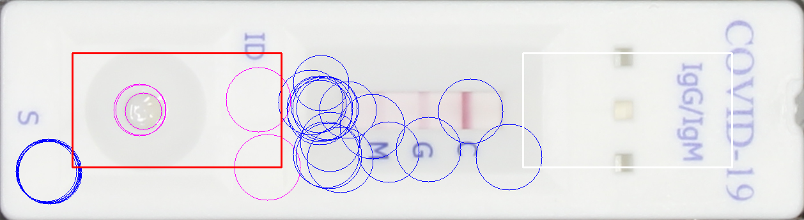


* `IMAGE_FILE_NAME_sensor`: Aligned sensor crop showing the bands.

  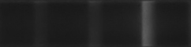


* `IMAGE_FILE_NAME_peak_overlays`: Sensor crop with colored rectangle overlay(s) indicating the area(s) where the signal for each detected band is quantified. Notice that the rectangle extends to cover the whole area under the curve, from background level through peak and back to background level.

  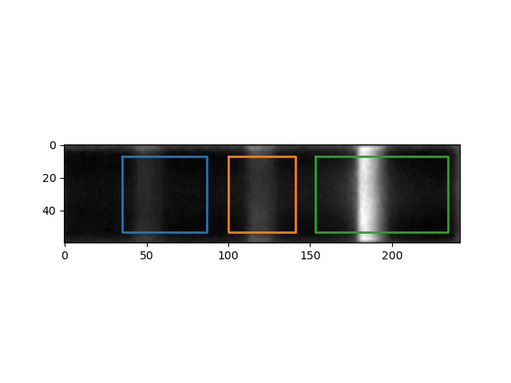

* `IMAGE_FILE_NAME_peak_background_estimation`: Control figure displaying the performance of the background estimation fit. Black dashed line is a an estimation of the background level obtained by robust linear fit of the band profile. From the estimate background trend a constant value is subtracted (resulting red solid line). This is to make sure that the signal is flat after correction, but no values are clipped.

  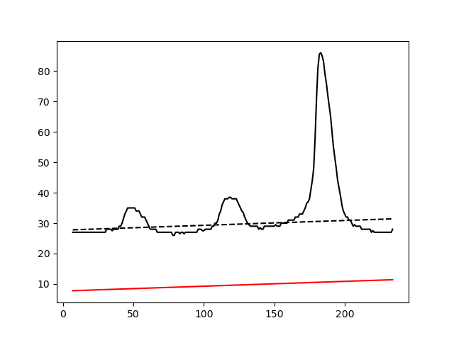

* `IMAGE_FILE_NAME_peak_analysis`: Control figure displaying the performance of the peak analysis. Red circle indicates the max peak height. The green dashed line is an estimate of the local background that is used to test all candidate local maxima against a threshold defined by the red dashed line. This line is calculated as the (median of the background values) + `f` * (median deviation of the background values). The factor `f`   is a user parameter and defaults to 2. The solid blue, orange and green line under the curves indicate the local span of each of the bands and indicate which part of the signal is integrated.

  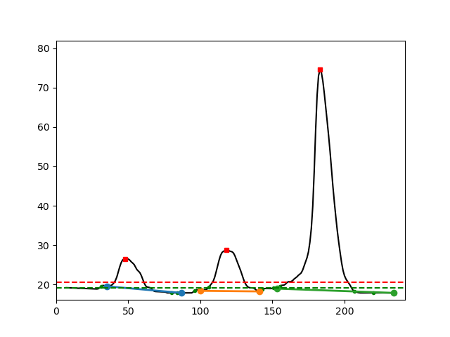


### Log file <a name="resultlog"></a>

The log file contains more detailed information for each processed image identified by its file name such as `Img0052.jpg`. 

It informs about the barcode extraction and its rotation, the QR code box rotation, the FID extraction, the actual sensor coordinates and the identified bands.

Example log:

```
File = IMG_8489.JPG
Processing IMG_8489.JPG
Best percentiles for barcode extraction: (0, 100); best scaling factor = 0.25; score = 6/6
File IMG_8489.JPG: best percentiles for barcode extraction after rotation: (0, 100); best scaling factor = 0.25; score = 6/6
File IMG_8489.JPG: Strip box image rotated by angle -0.9172186022623166 degrees using QR code locations.
File IMG_8489.JPG: FID = 'F5923994'
File IMG_8489.JPG: sensor coordinates = [140, 207, 523, 780], score = 1.0
Peak 69 has lower bound 48 (d = 21) with relative intensity 0.06 and upper bound 93 (d = 24) with relative intensity 0.00. Band width is 46. Band skewness is 1.14
Peak 138 has lower bound 104 (d = 34) with relative intensity 0.00 and upper bound 162 (d = 24) with relative intensity 0.10. Band width is 59. Band skewness is 0.71
Peak 203 has lower bound 170 (d = 33) with relative intensity 0.04 and upper bound 248 (d = 45) with relative intensity 0.00. Band width is 79. Band skewness is 1.36
File IMG_8489.JPG: the bands were 'normal'.
✓ File IMG_8489.JPG: successfully processed and added to results table.
```

### Settings file <a name="resultsettings"></a>

 A settings file is created in the `-o /PATH/TO/RESULTS/FOLDER` with the actually used parameters for the analysis. It can be used to reproduce the obtained results.

See [settings file section](#Settings) for detailed description.


## Graphical user interface <a name="gui"></a>

The GUI offers several actions via the menu, the toolbar and buttons.

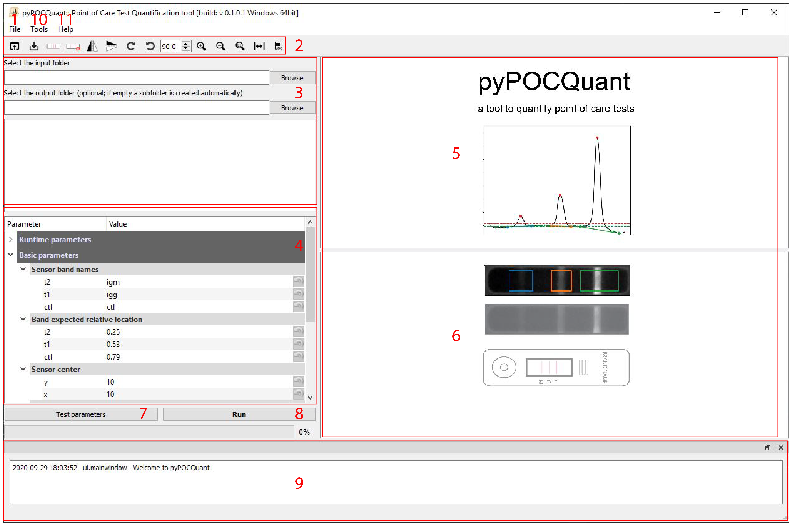

1. `File menu`:

   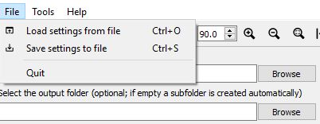

   * `File`: Lets you load ( `File` --> `Load settings file`) and save ( `File` --> `Save settings file`) a settings file
   
   * `Help`: Get quick instructions and open this manual
   
2. `Toolbar`:

   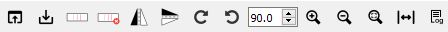

   * `Load settings from file`: Load settings from file into the Parameter Tree.
   * `Save settings to file`: Save current settings to file.
   * `Draw sensor outline`: Activates drawing a polygon by clicking into the corners of the sensor on the images.
   * `Delete sensor`: Deletes currently drawn sensor.
   * `Mirror image vertically`: Mirrors the displayed image vertically.
   * `Mirror image horizontally`: Mirrors the displayed image horizontally.
   * `Rotate clockwise`: Rotates the displayed image clock wise.
   * `Rotate counter clockwise`: Rotates the displayed image counter clock wise.
   * `Set rotation angle in degrees`: Specifies the rotation angle.
   * `Zoom in`: Zooms in  the displayed image.
   * `Zoom out`: Zooms out  the displayed image .
   * `Reset zoom`: Resets the zoom level.
   * `Measure distance`: Lets you draw a line on the image to measure distances. It will update the `qr_border_distance` parameter.
   * `Show / hide console`: shows or hides the console at the bottom of the UI.

3. `Select input folder`: Allows to specify the input folder.

   `Select output folder`: (Optional) Lets you select a output folder. If left empty a output subfolder is automatically generated  in the input folder.

   `Image list`: Lists all available images in the input folder. Click onto the filename to display one in **5**.

4. `Parameter Tree`: Adjust parameters manually if needed.

5. `POCT area`: Shows the extracted POCT and allows for drawing the sensor.

6. `Display area`: Shows the currently selected image.

7. `Test parameters`: Runs the pipeline on the selected image with current settings. The test folder will be opened automatically to inspect the control files.

8. `Run`: Runs the pipeline with the current settings**.

10. `Log`: Informs the user about performed actions.

11. `Tools menu`:

    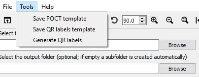

    * `Save POCT template`: Lets you save and print the POCT template to be used for the image acquisition.

    * `Save QR labels template` Lets you save an Excel template to be used to generate QR code labels for all your samples from a list.

    * `Generate QR labels`: Lets you generate QR labels for your samples using the excel template or a csv file with a list of the names in the correct format (SAMPEID-MANUFACTURER-PLATE-Well-USER). You can define the page size, label size, position and number per page to match the format for any printable label paper as i.e from AVERY.

      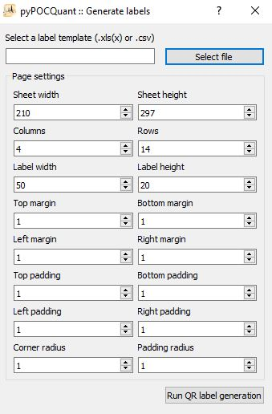

12. `Help menu`:

    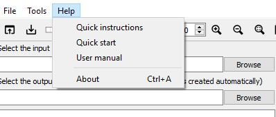

    * `Quick instructions`: Shows the quick instructions dialog.

    * `Quick start`: Opens the quick start document describing how to set up the image acquisition setup, perform the acquisition and some potential problems and their solutions one might encounter.

    * `User manual`: Opens this document.

    * `About`: About the software and its dependencies.

