# pyPOCQuant user manual

## Table of contents

1. [Introduction](#introduction)
2. [Quick start](#quickstart)
   2.1. [Split images by strip manufacturer](#splitimages)
   2.2. [Settings file preparation](#settingsprep)
    	2.2.1.[How to determine the parameters manually](#settingsprepm)
    	2.2.2 [How to determine the parameters automatically using the GUI](#settingsprepa)
   2.3. [Run pipeline](#runpipeline)
   	2.3.1. [Run the analysis per manufacturer manually](#runpipelinem)
    	2.3.2. [Run the analysis per manufacturer automatically using the GUI](#runpipelineg)
3. [Settings file](settingsfile)
   3.1 [Explanations](#settingsfilee)
4. [Description of results](#resultsdescription)
   4.1. [Result table](#resulttable)
   4.2. [Quality control images](#resultimages)
   4.3. [Log file](#resultlog)
   4.4. [Settings file](#resultsettings)
5. [Graphical user interface (GUI)](#gui)


## Introduction <a name="introduction"></a>
The tool pyPOCQuant aims to automatically detect and quantify signal bands from Point of Care tests (POC or POCT) from an image. It can batch analyze large amounts of images in parallel.


## Quick start <a name="quickstart"></a>

1. Copy all the images of the same kind into one folder
2. Prepare a settings file
3. Run the pipeline

### 1. Split images by strip manufacturer <a name="splitimages"></a>
If you have many images in an unorganized way we have a helper script to sort them by manufacturer into subfolders.

```python
$ python ./split_images_by_strip_type_parallel.py -f /PATH/TO/INPUT/FOLDER -o /PATH/TO/OUTPUT/FOLDER -w ${NUM_WORKERS}
```

* `/PATH/TO/INPUT/FOLDER`: path to the folder that contains all images for a given camera.

* `PATH/TO/OUTPUT/FOLDER`: path where all images will be organized into subfolders; one per each strip manufactured. Strip images that cannot be recognized (or do not contain any strip) will be moved to an ` UNDEFINED` subfolder.

  * Currently  recognized manufacturers: 
  * `AUGURIX`
    * `BIOZAK`
    * `CTKBIOTECH`
    * `DRALBERMEXACARE`
    * `LUMIRATEK`
    * `NTBIO`
    * `SUREBIOTECH`
    * `TAMIRNA`

**Please notice**: the list of known manufacturers is defined in `pyPOCQuant.consts.KnownManufacturers`.

* `NUM_WORKERS`: number of  parallel processes; e.g. `8`.


### 2. Settings file preparation <a name="settingsprep"></a>

#### How to determine the parameters manually <a name="settingsprepm"></a>

Copy [settings file](#settingsfile) to an empty text file and adjust the parameters to fit your images.

Sensor parameters are relative to the strip image.


Position and extent of areas can easily be obtained, for instance, in Fiji.

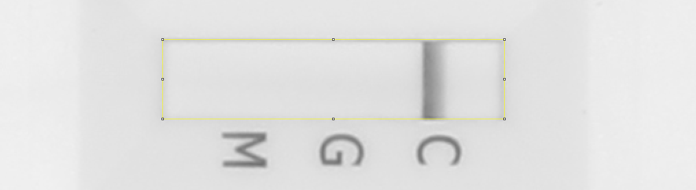

* When drawing a rectangular region of interest, the size is displayed in Fiji's toolbar; e.g. `x=539, y=145, **w=230, h=62**`.
* When hovering over the central pixels in the top or left sides of the selection, the `x`, and `y` coordinates of the center, respectively, are show in Fiji's toolbar; e.g. `x=*601*, y=144, value=214` (and equivalently for `y`).

#### How to determine the parameters automatically using the GUI <a name="settingsprepa"></a>

Use the user interface which will automatically generate the settings file for you and enables you to test the settings before running the full pipeline.

* Select the input folder and click on an image to display it.
* (1) Hit the `Draw sensor outline` icon in the toolbar and (2) click into the corners of the sensor. The image might need to be rotated and zoomed first.

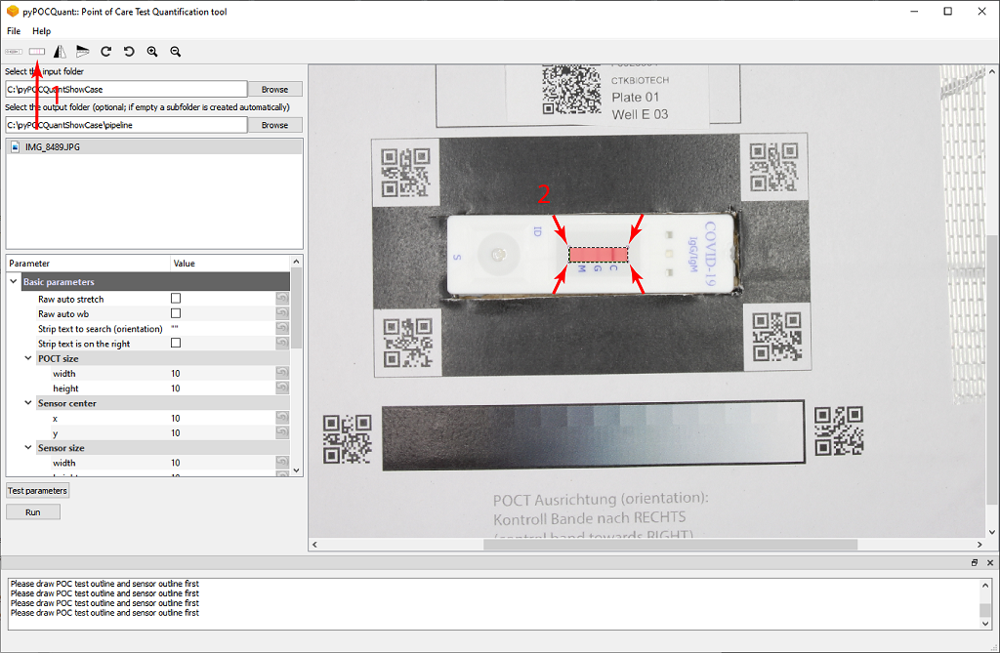

* Hit the `Draw POCT outline` icon in the toolbar and click into the corners of the POCT

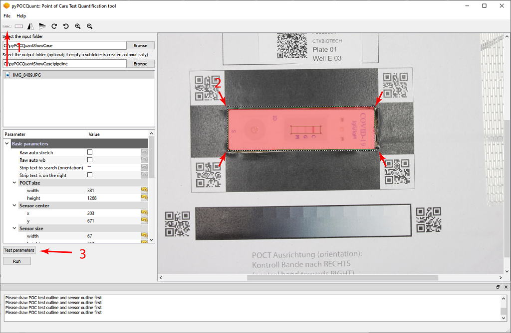

* The parameters will now be estimated automatically from the image.
* Test the parameters by clicking the `test parameters` button (3). And adjust the polygons or the parameters  if needed.
* Save the settings file (Ctrl+S, `File`->`Save settings file`)


### 3. Run the pipeline <a name="runpipline"></a>

#### Run the analysis per manufacturer manually <a name="runpiplinem"></a>

```python
$ python pyPOCQuant_FH.py -f /PATH/TO/INPUT/FOLDER/MANUFACTURER -o /PATH/TO/RESULTS/FOLDER -s /PATH/TO/CONFIG/FILE -w ${NUM_WORKERS} 
```

* `/PATH/TO/INPUT/FOLDER/MANUFACTURER`: path to the folder that contains all images for a given camera and manufacturer.
* `/PATH/TO/RESULTS/FOLDER`: path where the results (and the quality control images) for a given camera and manufacturer will be saved. The results are saved in a `quantification_data.csv` text file.
* `/PATH/TO/CONFIG/FILE`: path to the configuration file to be used for this analysis. Please see below. Notice that a configuration file will be needed per manufacturer and (possibly) camera combination.
* `NUM_WORKERS`: number of  parallel processes; e.g. `8`.

#### Run the analysis per manufacturer automatically using the GUI  <a name="runpiplinea"></a>

* (1) Load a settings file (Ctrl+O, `File`->`load settings file`)
* (2) Select the input folder (Ctrl+I)
* `test parameters` (optional)
* (3) `Run` Click run button to run the pipeline.

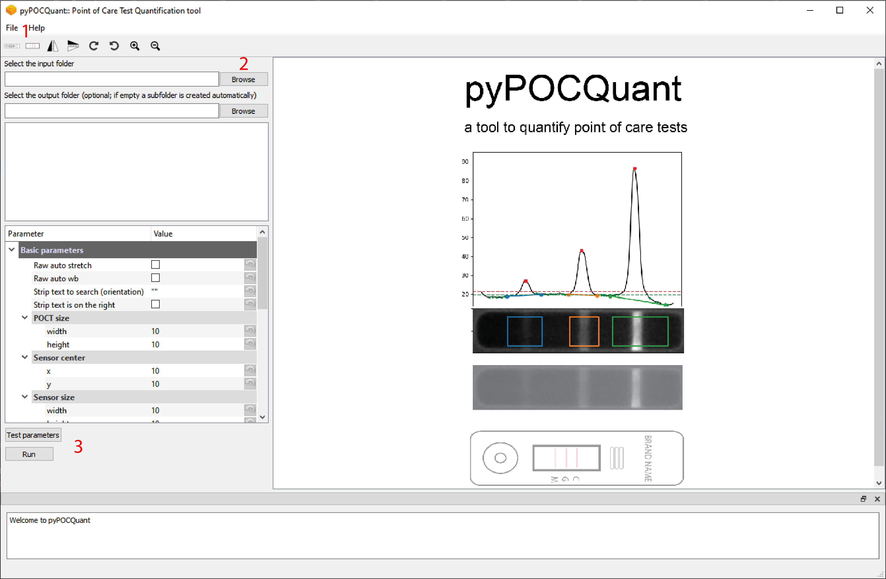


## Settings file <a name="settingsfile"></a>

The following settings must be specified. These are default values and need to be adopted for a series of the same kind of images. Please note: in the following, `strip` is used to indicate the POCT, and `sensor` to indicate the measurement region within the `strip`.

```bash
raw_auto_stretch=False
raw_auto_wb=False
strip_text_to_search="COVID"
strip_text_on_right=True
min_sensor_score=0.85
qr_code_border=40
sensor_size=(62, 230)
sensor_center=(152, 601)
subtract_background=True
sensor_border_x=7
sensor_border_y=7
perform_sensor_search=True
sensor_thresh_factor=2
sensor_search_area=(71, 259)
peak_expected_relative_location=(0.25, 0.53, 0.79)
verbose=True
qc=True
```

### Explanations <a name="settingsfilee"></a>

#### Essential parameters

##### sensor_size

* Area in pixels of the sensor to be extracted: `(height, width)`.

##### sensor_center

*  Coordinates in pixels of the center of the sensor with respect to the strip image: `(y, x)`.

##### sensor_search_area

* Search area in pixels around the sensor: `(height, width)`. 
* Used only if `skip_sensor_search` is `False`.
* **Try to keep it just a bit larger than the sensor size: in particular, try to avoid picking up features (e.g. text) in close proximity of the sensor.**

##### sensor_border_x

* Lateral sensor border in pixels to be ignored in the analysis to avoid border effects.

##### sensor_border_y

* Vertical sensor border in pixels to be ignored in the analysis to avoid border effects.

##### subtract_background

* If `True`, estimate and subtract the background of the sensor intensity profile (bands).
* Possible values: `True` or `False`
* Recommended: `True`

##### perform_sensor_search

* If `True`, the (inverted) sensor is searched within `sensor_search_area` around the expected `sensor_center`; if `False`, the sensor of size `sensor_size` is simply extracted from the strip image centered at the relative strip position `sensor_center`.
* Possible values: `True` or `False`
* Recommended: `True`

##### peak_expected_relative_location

* Expected relative peak positions as a function of the width of the sensor (= 1.0).

  | POCT            | peak_expected_relative_location |
  | --------------- | ------------------------------- |
  | AUGURIX         | (0.30, 0.50, 0.70)              |
  | BIOZAK          | (0.25, 0.50, 0.75)              |
  | CTKBIOTECH      | (0.25, 0.53, 0.79)              |
  | SUREBIOTECH     | (0.31, 0.54, 0.75)              |
  | TARMINA         |                                 |
  | DRALBERMEXACARE |                                 |
  | LUMIRATEK       |                                 |
  | NTBIO           |                                 |

  **Pre-calculated `peak_expected_relative_location` values for known POCTs.**

##### qr_code_border

* Lateral and vertical extension of the (white) border around each QR code.

##### strip_text_to_search

* Text to search on the strip to assess orientation. Set to `""` to skip. This can help if the automatic estimation of the strip orientation fails. If the strip has some text printed on either side of the sensor, it can be searched to guess the orientation. See also `strip_text_on_right`.

##### strip_text_on_right
* Assuming the strip is oriented horizontally, whether the `strip_text_to_search` text
    is expected to be on the right. If `strip_text_on_right` is `True` and the text is found on the
    left hand-side of the strip, the strip will be rotated 180 degrees.
* Ignored if `strip_text_to_search` is `""`.

#### Info parameters

##### verbose

* Toggle extensive information logging.
* Possible values: `True` or `False`
* Recommended: `True` when testing parameters.

##### qc

* Toggle creation of quality control images.
* Possible values: `True` or `False`
* Recommended: `True` when testing parameters.

#### Advanced parameters

These parameters will most likely work with the default values above.

##### sensor_thresh_factor

* Set the number of (robust) standard deviations away from the median band background for a peak (band)
      to be considered valid.
* Recommended: `2`, maybe `3`.

##### raw_auto_stretch

* Whether to automatically correct the white balance of RAW images on load. This does not affect JPEG images!
* Possible values: `True` or `False`
* Recommended: `False`

##### raw_auto_wb

* Whether to automatically stretch image intensities of RAW images on load. This does not affect JPEG images!
* Possible values: `True` or `False`
* Recommended: `False`


## Description of results <a name="resultsdescription"></a>
### Result table <a name="resulttable"></a>

#### Structure and description of the result table:

* `fid`: patient FID in the form `F5921788`
* `fid_num`: just the numeric part of the FID (i.e., `5921788`)
* `filename`: name of the analyzed image
* `extension`: extension (either *.JPG or *.NEF)
* `basename`: filename without extension
* `iso_date`: date of image acquisition in the form YYYY-MM-DD (e.g. 2020-04-14)
* `iso_time`: time of image acquisition in the form HH-MM-SS (24-h format)
* `exp_time`: camera exposure time
* `f_number`: aperture F number
* `focal_length_35_mm`: 35mm equivalent focal length
* `iso_speed`: camera ISO value
* `manufacturer`:  POCT manufacturer
* `plate`: plate number
* `well`: well (e.g. `A 01`)
* `ctl`: 1 if the control band could be extracted, 0 otherwise.
* `igm`: 1 if the IgM band could be extracted, 0 otherwise.
* `igg`: 1 if the IgG band could be extracted, 0 otherwise. 
* `ctl_ratio`: relative signal strength of the control band (always 1.0 if detected)
* `igm_ratio`: relative signal strength of the IgM band with respect to the control band
* `igg_ratio`: relative signal strength of the IgG band with respect to the control band
* `issue`: if issue is 0, the image could be analyzed successfully, if issue > 0 it could not. See the list of issues below
* `user`: custom field

##### Analysis issues

Each analyzed image is assigned an integer `issue`:

* 0: no issue, the analysis could be performed successfully

* 1: barcode extraction failed

* 2: FID extraction failed

* 3: poor strip alignment (see `strip_corr_coeff` column in the results data table)

* 4: sensor extraction failed (see `sensor_score` column in the results data table)

* 5: peak/band quantification failed

* 6: control band missing

  

### Quality control images <a name="resultimages"></a>

Types and examples' of quality control images:

Raw image here just shown as comparison:
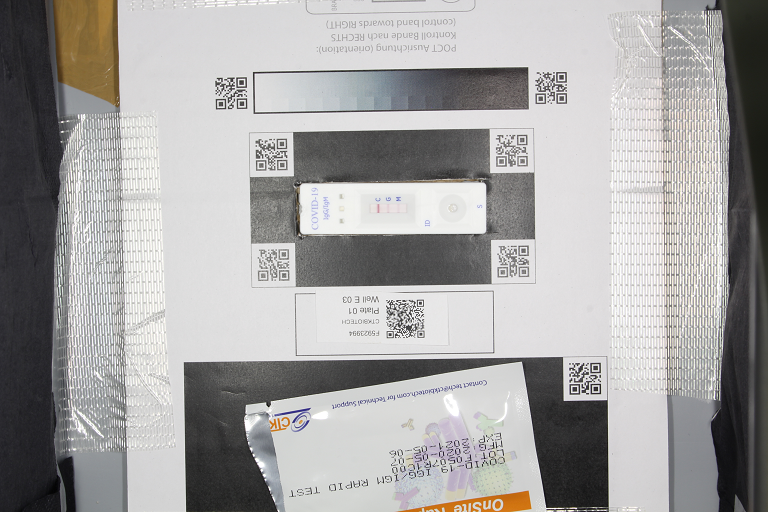


* `IMAGE_FILE_NAME_aligned_box` Aligned raw image
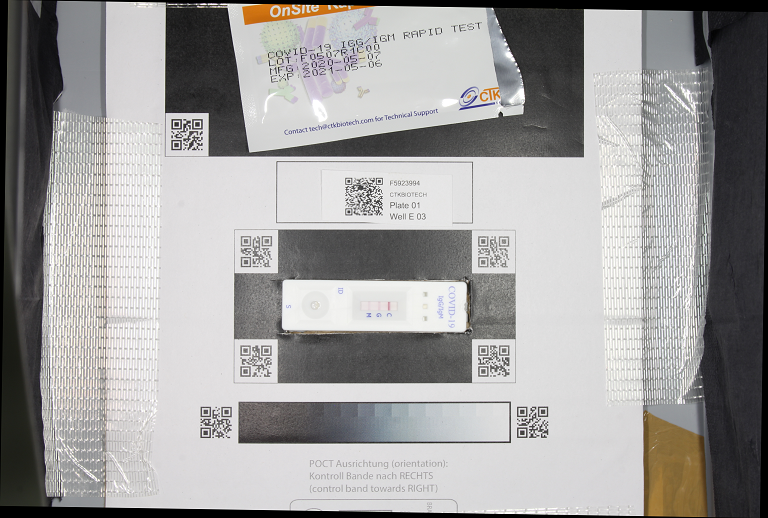
* `IMAGE_FILE_NAME_box` : QR code box around the POCT oriented such that the control band is always on the right side.
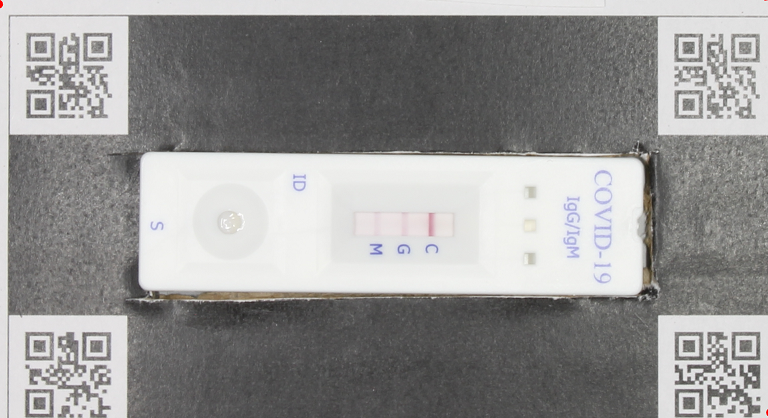

* `IMAGE_FILE_NAME_rotated`: Raw image rotated such that the POCT is at the parallel to the bottom side of the image.
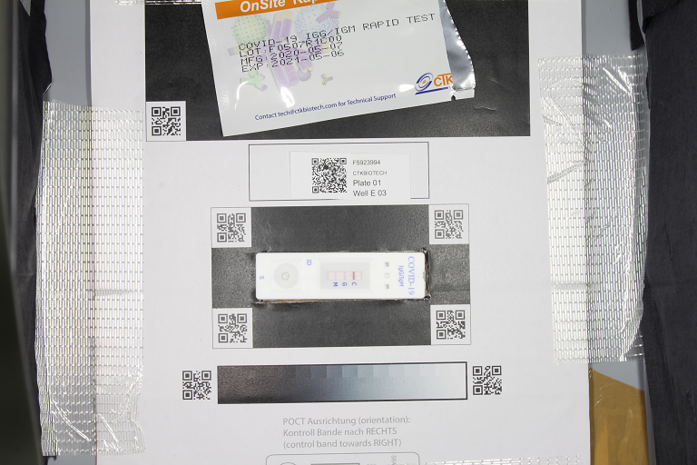


* `IMAGE_FILE_NAME_strip_gray_aligned`: Aligned POCT cropped around its outline such that it is parallel to the bottom side.
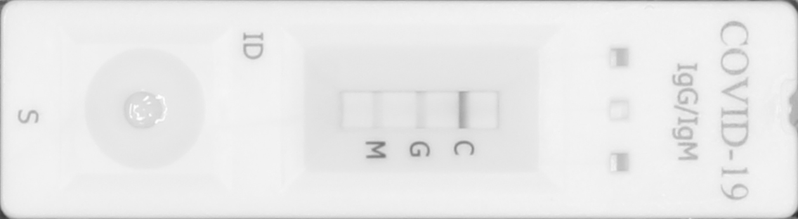

* `IMAGE_FILE_NAME_strip_gray_aligned_after_ocr` Aligned POCT cropped around its outline such that it is parallel to the bottom side after OCR filtering such that the pipetting part is always left (for the cases where the POCT was not placed in the correct orientation in the template.)


* `IMAGE_FILE_NAME_sensor`: Aligned sensor crop showing the bands.
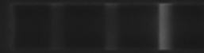

* `IMAGE_FILE_NAME_peak_overlays`: Sensor crop with colored rectangle overlay(s) indicating the area(s) where the signal for each detected band is quantified. Notice that the rectangle extends to cover the whole area under the curve, from background level through peak and back to background level.
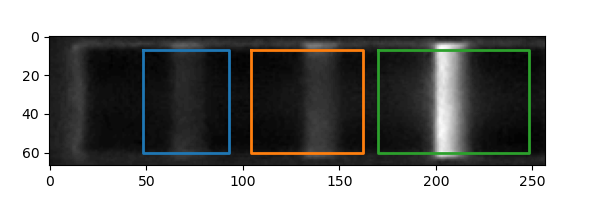

* `IMAGE_FILE_NAME_peak_background_estimation`: Control figure displaying the performance of the background estimation fit. Black dashed line is a an estimation of the background level obtained by robust linear fit of the band profile. From the estimate background trend a constant value is subtracted (resulting red solid line). This is to make sure that the signal is flat after correction, but no values are clipped.
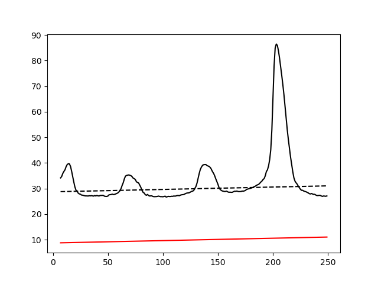

* `IMAGE_FILE_NAME_peak_analysis`: Control figure displaying the performance of the peak analysis. Red circle indicates the max peak height. The green dashed line is an estimate of the local background that is used to test all candidate local maxima against a threshold defined by the red dashed line. This line is calculated as the (median of the background values) + `f` * (median deviation of the background values). The factor `f`    is a user parameter and defaults to 2. The solid blue, orange and green line under the curves indicate the local span of each of the bands and indicate which part of the signal is integrated.
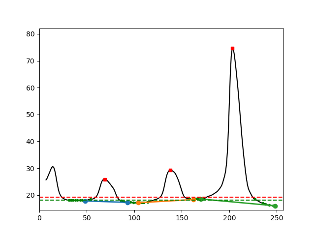


### Log file <a name="resultlog"></a>

The log file contains more detailed information for each processed image identified by its file name such as `Img0052.jpg`. 

It informs about the barcode extraction and its rotation, the QR code box rotation, the FID extraction, the actual sensor coordinates and the identified bands.


Example log:

```
File = IMG_8489.JPG
Processing IMG_8489.JPG
Best percentiles for barcode extraction: (0, 100); best scaling factor = 0.25; score = 6/6
File IMG_8489.JPG: best percentiles for barcode extraction after rotation: (0, 100); best scaling factor = 0.25; score = 6/6
File IMG_8489.JPG: Strip box image rotated by angle -0.9172186022623166 degrees using QR code locations.
File IMG_8489.JPG: FID = 'F5923994'
File IMG_8489.JPG: sensor coordinates = [140, 207, 523, 780], score = 1.0
Peak 69 has lower bound 48 (d = 21) with relative intensity 0.06 and upper bound 93 (d = 24) with relative intensity 0.00. Band width is 46. Band skewness is 1.14
Peak 138 has lower bound 104 (d = 34) with relative intensity 0.00 and upper bound 162 (d = 24) with relative intensity 0.10. Band width is 59. Band skewness is 0.71
Peak 203 has lower bound 170 (d = 33) with relative intensity 0.04 and upper bound 248 (d = 45) with relative intensity 0.00. Band width is 79. Band skewness is 1.36
File IMG_8489.JPG: the bands were 'normal'.
✓ File IMG_8489.JPG: successfully processed and added to results table.
```


### Settings file <a name="resultsettings"></a>

 A settings file is created in the `-o /PATH/TO/RESULTS/FOLDER` with the actually used parameters for the analysis. It can be used to reproduce the obtained results.

See [settings file section](#settingsfile) for detailed description.

## Graphical user interface <a name="gui"></a>

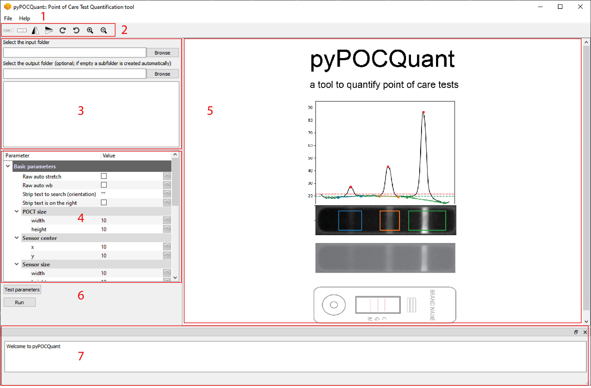

1. `File menu`:

   * `File`: Lets you load ( `File`-> `Loadsettings file`) and save ( `File`->`Save settings file`) a settings file

   * `About`: Get quick instructions and open this manual
2. `Toolbar`:
   * `Draw POCT outline`: Activates drawing a polygon by clicking into the corners of the POCT on the images.
   * `Draw sensor outline`: Activates drawing a polygon by clicking into the corners of the sensor on the images.
	* `Mirror image vertically`: Mirrors the displayed image vertically
	* `Mirror image horizontally`: Mirrors the displayed image horizontally
	* `Rotate image cw`: Rotates the displayed image clock wise
	* `Rotate image ccw`: Rotates the displayed image counter clock wise
	* `Zoom in`: Zooms in  the displayed image 
	* `Zoom out`: Zooms out  the displayed image 
3. `Open input folder`: Lets you open the input folder

   `Open output folder`: (Optional) Lets you select a output folder. If left empty a output subfolder is automatically generated  in the input folder.

   `Image list`: Lists all available images in the input folder. Click onto the filename to display one in **5**

4. `Parameters`: Adjust parameters manually if needed.

5. `Display area`: Area to display an image.

6. `test parameters`: Runs the pipeline on the displayed image with the current settings specified in **4**. The test folder will be opened automatically to inspect the control files.

   `run pipeline`: Runs the pipeline with the current settings specified in **4**. If a settings file exist you can load it in **1** and run it directly after selecting the correct input folder in **3**.

7. `Log`: Information the user about performed actions.